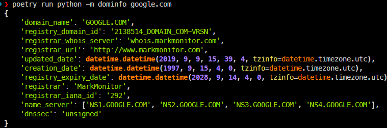

# Dominfo

**Dominfo** is a modern, lightweight Python library and CLI tool for performing WHOIS domain lookups. It provides a simple interface to query IANA servers and retrieve domain registration details, with support for pretty-printed terminal output or raw JSON data.

-----

## ⚡ Features

  * **Dual Mode:** Use it as a command-line tool or import it as a Python library.
  * **Rich Output:** Beautifully formatted terminal output using the [Rich](https://github.com/Textualize/rich) library.
  * **JSON Support:** Easily export WHOIS data to JSON for programmatic processing.
  * **Customizable:** Support for custom IANA servers.

-----

## 📦 Installation

You can install `Dominfo` via pip:

```bash
pip install dominfo
```

-----

## 🚀 Usage

### 1\. As a CLI Tool

You can run `dominfo` directly from your terminal to get information about a domain.

**Basic Lookup:**
Get a pretty-printed overview of the domain.

```bash
python -m dominfo google.com
```

**JSON Output:**
Get the output in machine-readable JSON format (useful for piping into `jq` or other tools).

```bash
python -m dominfo google.com --json
# or
dominfo google.com -j
```



**Custom IANA Server:**
Specify a specific WHOIS server if needed.

```bash
python -m dominfo google.com --iana-server whois.nic.ai
```

### 2\. As a Python Library

You can easily integrate `Dominfo` into your own Python scripts.

```python
from dominfo.client import DominfoClient

# Initialize the client
client = DominfoClient()

# Fetch WHOIS information
whois_info = client.get_whois_info("google.com")

# Print the result (returns a dictionary/object)
print(whois_info)
```

**Using a custom server in Python:**

```python
client = DominfoClient(server="whois.verisign-grs.com")
info = client.get_whois_info("google.com")
```

-----

## 📝 Dependencies

  * [**Typer**](https://typer.tiangolo.com/): For the Command Line Interface.
  * [**Rich**](https://github.com/Textualize/rich): For beautiful terminal formatting.

-----